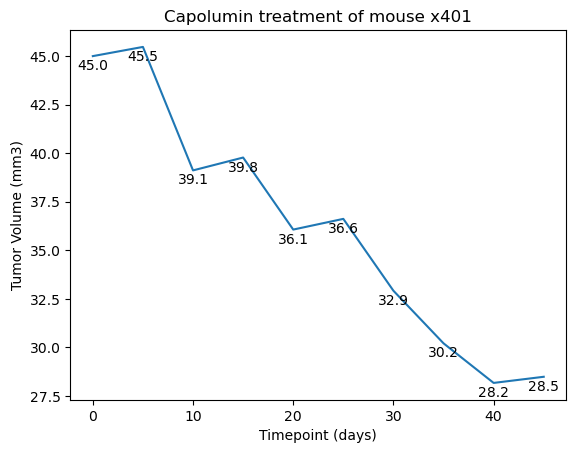

#  Capomulin Treatment Effectivity in Mice for Squamous Cell Carcinoma (SCC)

## Main observations

1. Capomulin reduces the tumor volume in mice with SCC just as Ramicane.
2. Study was conducted with the proportion of male and female mice.
3. Increased weight corralates with increase volume of tumor, which indicate a strong positive corralation with an R value of 0.84.

## Introduction

In this report, the treatment effectiveness of Capomulin for SCC in mice is analyzed and compared to other 8 drugs:
- Ramicane
- Ketapril
- Naftisol
- Zoniferol
- Stelasyn
- Ceftamin
- Infubinol
- Propriva

249 mice's tumors were monitored during 45 days. The response variables measured were the volume of the tumor in cubic milimeters and quantity metastasic sites.

Placebo was considered for control group purposes.

The data registered from subjects was sex, age in months, weight in grams.
Mice sex distribution is 50.2% male and 49.8 female.
Age and sex of the mice is considered as non relevant variables in this analysis.
Tumor volume (TV) and Metastasic Sites (MS) were registered every 5 days.
Each mouse was uniquely identified for treatment evolution purposes.

## Analysis

Capomulin showed promising results considering the average TV during the 45 days and the standard deviation is much lower than that of other drugs or placebo, except for Ramicane. These values are shown in Table 1 and Figure 1.

Table 1. Mean, median, variance, standard deviation and standard error mean from all the TV registred.

|              | Tumor Volume (mm3) |           |           |          |          |
|-------------:|-------------------:|----------:|----------:|---------:|---------:|
| Drug Regimen |               mean |    median |       var |      std |      sem |
|    Capomulin |          40.675741 | 41.557809 | 24.947764 | 4.994774 | 0.329346 |
|     Ceftamin |          52.591172 | 51.776157 | 39.290177 | 6.268188 | 0.469821 |
|    Infubinol |          52.884795 | 51.820584 | 43.128684 | 6.567243 | 0.492236 |
|     Ketapril |          55.235638 | 53.698743 | 68.553577 | 8.279709 | 0.603860 |
|     Naftisol |          54.331565 | 52.509285 | 66.173479 | 8.134708 | 0.596466 |
|      Placebo |          54.033581 | 52.288934 | 61.168083 | 7.821003 | 0.581331 |
|     Propriva |          52.393463 | 50.909965 | 43.138803 | 6.568014 | 0.525862 |
|     Ramicane |          40.216745 | 40.673236 | 23.486704 | 4.846308 | 0.320955 |
|     Stelasyn |          54.233149 | 52.431737 | 59.450562 | 7.710419 | 0.573111 |
|    Zoniferol |          53.236507 | 51.818479 | 48.533355 | 6.966589 | 0.516398 |

Figure 1. Boxplot comparison between 4 drug regimens: Capomulin Ramicane, Infubinol and Ceftamin.

Subject x401 showing reduction of tumor size over time.

There is a strong positive corralation between mouse weight and tumor volume.

Data was also cleaned up by removing repeated values for subject g989.

